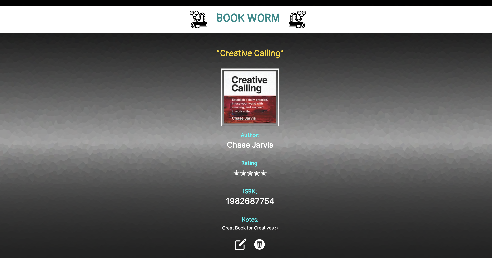

# Capstone5: Book Worm Application


## 'Book Worm' is a web application designed to be an online platform to share your personal book list. 
This application allows Book Readers to showcase the books they read, provide feedback notes, sort items by author(s) or title(s), and add books using [OpenLibrary's Public API](https://www.openlibrary.org).
This project was created to showcase my abilities utilizing C.R.U.D. and R.E.S.Tful API methods with Javascript, NodeJS, CSS and HTML.

# Getting Started:

## **Prerequisites:**

1. ```Postgres SQL```
2. ```NodeJs```
3. ```ExpressJS```

## **Installation:**
**Install:**

- ```NodeJS``` 
* ```PostgresSQL```
+ ```PgAdmin```
- Clone the Repository

##  **Configuration:**

- Create a DB named **'books'**, --> ```CREATE TABLE books```
* Run --> ```npm install```
+ The DB Port, Username, and Password Credentials are located in the ```index.js```.

## **Running the Application:**
- Run ```nodemon index.js```

## **Author(s)**
Raymond Enriquez

## **Future Plans**

- [ ] User Registration + Login System
- [ ] Enhance UX/UI Design
